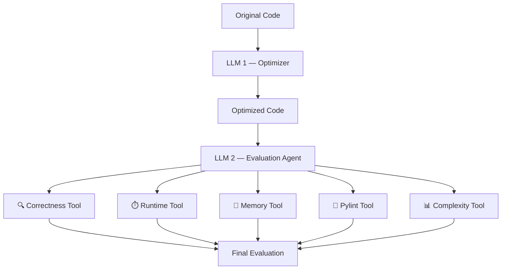

# Python Code Optimizer

A two-agent pipeline that optimizes Python code with one LLM, then verifies and scores that optimization with a second LLM equipped with five independent evaluation tools.

Optimization claims from an LLM shouldn't be taken on faith — this project treats "the code is now faster/cleaner" as something to be *proven*, not just asserted.

## Architecture



## How it works

1. **LLM 1 (Optimizer)** takes the original Python code and returns a dict:
   ```python
   {
       "code": "...",      # the optimized source
       "notes": { ... }    # problem, changes, improvements, tradeoffs, summary
   }
   ```
2. **LLM 2 (Evaluation Agent)** receives both the original and optimized code and decides, on its own, which tools to call and with what test cases — it isn't a fixed script, it's an agent built with LangChain's `create_agent`, given five tools and a system prompt that sequences them.
3. **Correctness gates everything else.** The agent is instructed to run `correctness_tool` first, exactly once, with one comprehensive test suite. If the optimization isn't behaviorally correct, the agent stops there — runtime, memory, style, and complexity are never checked on code that's already wrong.
4. The agent reports back a single markdown table comparing "Your Code" vs "Optimized Code" across all five metrics, plus a short verdict.

## The five tools

| Tool | What it measures | Executes the code? |
|---|---|---|
| `correctness_tool` | Runs both versions against the same test cases, compares outputs | Yes (isolated subprocess, timeout) |
| `runtime_tool` | Times both versions (3 runs each, compared by median) | Yes (isolated subprocess, timeout) |
| `memory_tool` | Peak memory allocation via `tracemalloc` | Yes (isolated subprocess, timeout) |
| `pylint_tool` | Lints both versions, compares pylint scores and issues | No — static analysis only |
| `complexity_tool` | Cyclomatic complexity + maintainability index via `radon` | No — static analysis only |

All three code-executing tools run the target function in an isolated child process with a hard timeout, so a broken optimization (infinite loop, crash, runaway memory) can never hang or take down the agent itself.

### Correctness comparison details

Raw `==` comparison is too strict for real code, so `correctness_tool` handles two specific edge cases deliberately rather than reporting them as generic failures:

- **Floating-point noise.** `0.6` vs `0.6000000000000001` differ only due to summation order, not a logic bug — these are compared with `math.isclose` (tolerant) rather than exact equality, and a passing-but-inexact match is still noted in the result so it's visible, not hidden.
- **Order-only differences.** `[-2, 0]` vs `[0, -2]` are flagged distinctly as an *order* mismatch, not a *value* mismatch — because whether order matters is a property of the function's contract, not something the tool (or the LLM) can infer. This is controlled explicitly via `evaluate(..., order_matters=True/False)`, defaulting to `True` (strict) so nothing is silently ignored unless you've deliberately said order doesn't matter for that function.

## Setup

```bash
pip install langchain langchain-openai python-dotenv pylint radon
```

Create a `.env` file in the project root:
```
OPENROUTER_API_KEY=your-key-here
```
Get a key from [openrouter.ai/keys](https://openrouter.ai/keys). The agent is currently configured to use `nex-agi/nex-n2.5-pro:free` via OpenRouter's OpenAI-compatible endpoint (`ChatOpenAI` pointed at `https://openrouter.ai/api/v1`) — swap the `model=` string in `agent.py` for a different OpenRouter model if needed.

## Files

| File | Contents |
|---|---|
| `agent.py` | Builds the LLM 2 agent, registers all 5 tools, exposes `evaluate()` |
| `correctness_tool.py` | Correctness comparison tool |
| `runtime_tool.py` | Runtime comparison tool |
| `memory_tool.py` | Memory comparison tool |
| `pylint_tool.py` | Style/quality comparison tool |
| `complexity_tool.py` | Complexity/maintainability comparison tool |

## Usage

```python
from agent import evaluate

report = evaluate(
    original_code=original_code,       # str — the code before optimization
    optimized_code=llm1_result["code"], # str — LLM 1's output
    function_name="add_list",           # str — see note below
    order_matters=True,                 # optional, defaults to True
)
print(report)
```

Output is a single markdown table plus a 1-2 sentence summary:

| **Metric** | **Your Code** | **Optimized Code** |
|---|---|---|
| **Correctness** | Reference (ground truth) | Passed X/Y test cases |
| **Runtime** | median time | median time (Nx faster/slower) |
| **Memory** | peak usage | peak usage (Nx less/more) |
| **Pylint** | score/10, N issues | score/10, N issues |
| **Complexity** | CC, MI | CC, MI |

## Project Status — Ongoing
 
This is an active, in-progress project. The core pipeline (LLM 1 → LLM 2 → 5 evaluation tools) is built and each piece has been individually tested and verified working, but the following remains before it's a complete, end-to-end system:
 
- [ ] **Auto-detect `function_name`** instead of passing it in by hand. Under consideration: have LLM 1 also return the function name alongside `code`, or auto-detect it from `original_code` via Python's `ast` module (viable as long as each input is a single top-level function).
- [ ] **Connect LLM 1 → LLM 2 into one pipeline script.** Both stages work and have been tested independently; the remaining step is calling `evaluate()` with LLM 1's actual output in place of the hardcoded demo values currently in `agent.py`'s `__main__` block.
- [ ] **Broaden test coverage beyond simple functions.** Validated so far on list summation and duplicate-finding — needs testing against recursion, string processing, and nested-loop code before it can be considered reliable across problem types.
- [ ] **Monitor and improve tool-calling reliability of the evaluation model.** The current free-tier model (`nex-agi/nex-n2.5-pro:free`) has needed a retry after a malformed tool call, and — before the system prompt was tightened — called a tool more times than instructed. Continuing to watch whether it holds to the "exactly once, in this order" sequencing across different inputs, with a switch to a more capable model as a fallback if it doesn't.
- [ ] **Plan around OpenRouter's free-tier rate limits**, since repeated evaluations run in quick succession may get throttled.
 
